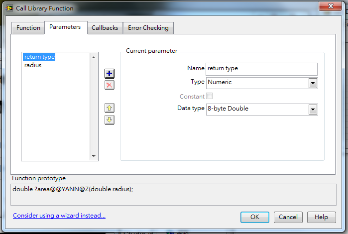
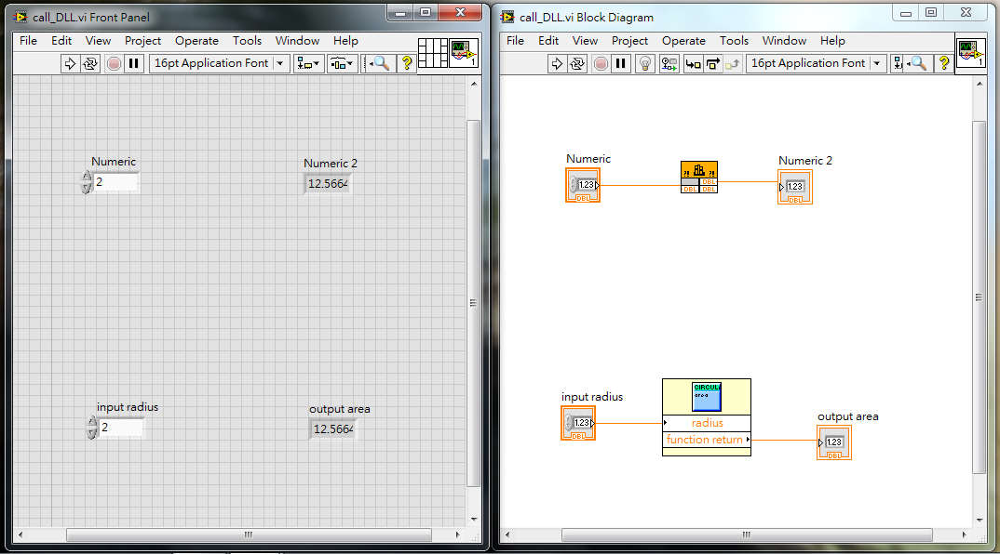

# LabVIEW calls Visual C++/dll interface

## Development machine

### Basic info

- Windows 7 Professional 32 bit
- Microsoft Visual Studio Community 2013
- NI LabVIEW 2013 (Version 13.0 32 bit)

### Set up

To call ``.dll`` functions inside of LabVIEW, [this link](http://www.ni.com/white-paper/3056/en/) and [this link](http://www.ni.com/white-paper/4877/en/) contains most information needed. Here are some comments after going through the entire process.

- To make ``.dll``, using Visual Studio is the most easiest way, since ``.dll`` is some really Windows thing. Just follow the wizard of ``Win32 console Application`` and everything should work.
- Most Visual Studio ``.dll`` tutorials are not that useful, because for our propose we may not need the complicated Object Oriented C++ codes. It turns out that the LabVIEW ``.dll`` tutorials are more helpful.
- ``__declspec(dllexport)`` is needed for the outside world to refer to the target function. ``extern "C"`` is not required if we just want things to work. Setup the ``.def`` file is another way, but I haven't try that.
- the ``.h`` file (which describe the ``.dll``-provided function) are not that useful for successfully compile the ``.dll`` file. But if you want to use the LabVIEW ``Tools > Import > Shared Library (.dll)`` wizard (comparing to the tedious LabVIEW process of setting up ``Functions > Connectivity > Libraries & Excusables > Call Library Function Node``), you need to have a ``.h`` to let LabVIEW parse, and fill the right setups into the right place.
- To call ``.dll`` using ``Functions > Connectivity > Libraries & Excusables > Call Library Function Node``, if LabVIEW gives "function not found in library" complain, it may caused by the reason that Visual Studio is opening. Also, after LabVIEW has linked to the ``.dll``, Visual Stuido can no longer build/compile. So make sure to *completely* close one program when trying to run the other.

Here are the codes:

###### ``dllmain.cpp`` (exactly the same as what the wizard is giving)

```cpp
#include "stdafx.h"

BOOL APIENTRY DllMain( HMODULE hModule,
                       DWORD  ul_reason_for_call,
                       LPVOID lpReserved
					 )
{
	switch (ul_reason_for_call)
	{
	case DLL_PROCESS_ATTACH:
	case DLL_THREAD_ATTACH:
	case DLL_THREAD_DETACH:
	case DLL_PROCESS_DETACH:
		break;
	}
	return TRUE;
}
```

###### ``CircularArea.h``

```cpp
#define M_PI 3.14159

__declspec(dllexport) double area(double radius);
```

###### ``CircularArea.cpp``

```cpp
#include "stdafx.h"
#include "math.h"
#include "CircularArea.h"

__declspec(dllexport) double area(double radius) {
	return M_PI * radius * radius;
}
```

Here are the tedious setting up of function parameters, if ``Functions > Connectivity > Libraries & Excusables > Call Library Function Node`` is used. The added function parameters need to follow the order they are defined in the C++ code.



Here are the LabVIEW result using the following two methods. They give the same result.

- (Above) using ``Functions > Connectivity > Libraries & Excusables > Call Library Function Node`` and setup all the parameters manually.
- (Below) using  ``Tools > Import > Shared Library (.dll)`` wizard, and import the resulting subVI.



## Testing machine

### Basic info

- Windows 7 64 bit
- No Microsoft Visual Studio pre-installed
- NI LabVIEW

### Set up

To run the .dll library in a computer with no Visual Studio, here are several key points for making everything right.

- Install Visual C++ Redistributable Packages (which include the C Runtime library). For ``.dll`` made by Visual Studio 2013, it is [Developer Tools Visual C++ Redistributable Packages for Visual Studio 2013](http://www.microsoft.com/en-us/download/details.aspx?id=40784). The particular support for *this* example, is that that will install ``msvcr120.dll`` in ``C:\Windows\System32`` for which the source file needs.
- Although the testing machine is 64 bit, the target installation is the 32 bit version ``vcredist_x86.exe``. Otherwise LabVIEW will still complain that it cannot find ``msvcr120.dll``.
- Use the release version (rather than the debug version) .dll compiled from Visual Stuido. Debug version uses ``msvcr120d.dll``, which is *not* in the Redistributable Packages.

For [more information](http://digital.ni.com/public.nsf/allkb/862567530005F09C862565C50068363D), when LabVIEW try to find out the system .dll libraries, it will try (1) The current directory that the executable is running from, (2) The Windows system directory (``<Windows>\System32``), (3) Any paths specified in the PATH environmental variable. We are using the second setup approach.