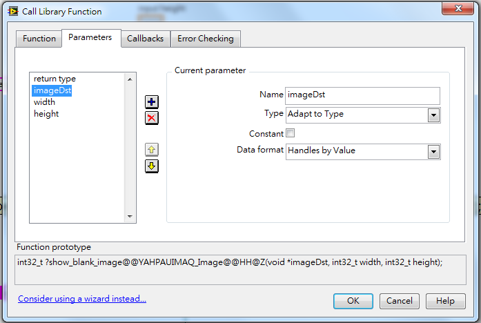

# LabVIEW calls OpenCV interface

## Development machine

### Basic info

- Windows 7 Professional 32 bit
- Microsoft Visual Studio Community 2013
- [OpenCV 2.4.10 for Windows](http://opencv.org/downloads.html)
- NI LabVIEW 2013 (Version 13.0 32 bit) with [NI Vision Module](http://www.ni.com/labview/vision/) pre-installed

### Set up

#### OpenCV

openCV的windows版的一個特別之處，是有對visual studio一些版本的pre-compile（比如2.4.10有支持vc10/11/12的x86和x64）。exe幾乎只是被extract到指定位置（不確定為什麼，但需要admin運行）。我extract之後裝到了``C:\Program Files\opencv\``。

如果只是打算用vc，用[這個link](http://docs.opencv.org/doc/tutorials/introduction/windows_install/windows_install.html#windowssetpathandenviromentvariable)最後一段設全局path。在我完全不知道怎麼用的繁體中文windows 7上，可以在search那裡輸path，然後出現的『編輯系統環境變數』就是了。添入``OPENCV_DIR``並定義``C:\Program Files\opencv\build\x86\vc12``，它的效果和

```shell
setx -m OPENCV_DIR "C:\Program Files\opencv\build\x86\vc12"
```

是一樣的。需要確認一下vc的版本，比如我是visual studio community 2013 == vc12，以及因為是32 bit Windows，所有用x86。除了這個，還要在``PATH``下面加一項``%OPENCV_DIR%\bin``。

之後設library可以基本follow[這個link](http://docs.opencv.org/doc/tutorials/introduction/windows_visual_studio_Opencv/windows_visual_studio_Opencv.html)。唯一的差別是，global library在2010之後變得很難設，比如按[它](http://blogs.msdn.com/b/vsproject/archive/2009/07/07/vc-directories.aspx)說得，consoleApp的話其實就是新開個project。所以就新開個project，按照上面那個link的說法把library設好。
 
基本這邊重要的是三個folder，
 
lib/一群.lib
bin/一群.dll
include/一群.h
 
前兩個是compile得的，這邊偷懶不compile，就在``C:\Program Files\opencv\build\x86\vc12``下面。對於這邊的情形，照著之前那個link把library位置一一填入該進的空。注意debug和release的project property是獨立的，要分別填入。因為Visual Studio的Redistributable Packages只支持release版，所以這邊只設置release。對於release版，具體說(1)``Property > Configuration Properties > C/C++ > General > Additional Include Dictionaries``下填入``$(OPENCV_DIR)\..\..\include``，(2)``Property > Configuration Properties > Linker > General > Additional Library Dictionaries``下填入``$(OPENCV_DIR)\lib``，(3)``Property > Configuration Properties > Linker > Input > Additional Dependencies``下填入

```
opencv_calib3d2410.lib
opencv_contrib2410.lib
opencv_core2410.lib
opencv_features2d2410.lib
opencv_flann2410.lib
opencv_gpu2410.lib
opencv_highgui2410.lib
opencv_imgproc2410.lib
opencv_legacy2410.lib
opencv_ml2410.lib
opencv_nonfree2410.lib
opencv_objdetect2410.lib
opencv_ocl2410.lib
opencv_photo2410.lib
opencv_stitching2410.lib
opencv_superres2410.lib
opencv_ts2410.lib
opencv_video2410.lib
opencv_videostab2410.lib
```

然後就應該能run hello world了。唯一要注意的是，add .lib file的時候，要記得把版本號是不是debug version的``*d``改對。

#### NI Vision Module

After successfully installed NI Vision Module into your computer, there should be a folder of its materials. Mine is in position ``C:\Program Files\National Instruments\Vision\``.

To make the NI Vision-related code runable, go to ``System Properties > Advanced > Environment Variables``, and add ``NIVISION_DIR`` as ``C:\Program Files\National Instruments\Vision``, and add an item ``%NIVISION_DIR%\Lib\MSVC`` in ``PATH``.

To make it compilable in Visual Studio, first setup a new ``Win32 Console Application`` following its setup wizard, and then for that project, (1) go to ``Property > Configuration Properties > C/C++ > General > Additional Include Dictionaries`` and add ``$(NIVISION_DIR)\Include``, (2) go to ``Property > Configuration Properties > Linker > General > Additional Library Dictionaries`` and add ``$(NIVISION_DIR)\Lib\MSVC``, (3) go to ``Property > Configuration Properties > Linker > Input > Additional Dependencies`` and add a term ``nivision.lib``, and (4) go to ``Property > Configuration Properties > Linker > Image has Safe Exception Handlers`` and change its value to ``NO (/SAFESEH:NO)``. In my case, Visual Studio gives linking errors if I am not doing the last step, which should cause by the version-inconsisent ``.lib`` files (since I use pre-compiled OpenCV and NI Vision files); this is a dirty (but working) way to handle that problem.

#### C++ codes

After successfully set up both OpenCV and NI Vision Module, the C++ codes should be compilable.

In here, I tested four sample functions, for cases

- Primitive type in/primitive type out, and call OpenCV functions inside.
- Image in/primitive type out, and call NI Vision functions inside.
- Primitive type in/image out, and do OpenCV pixel-wise operations inside.
- Image in/image out, and do OpenCV image filtering inside.

Notice that ``Image`` and ``ImageInfo`` are NI Vision format, while ``IplImage`` is OpenCV format. Their conversion has been shown explicitly inline.

###### ``OpencvLabviewTest.h``

```cpp
typedef struct {
	char *name;
	Image *address;
} IMAQ_Image;

__declspec(dllexport) int area(int width, int height);
__declspec(dllexport) int area_from_image(IMAQ_Image *imageSrc);
__declspec(dllexport) int show_blank_image(IMAQ_Image *imageDst, int width, int height);
__declspec(dllexport) int image_blur(IMAQ_Image *imageSrc, IMAQ_Image *imageDst);
```

###### ``OpencvLabviewTest.cpp``

```cpp
#include "stdafx.h"

#include <iostream>
#include <opencv2/core/core.hpp>
#include <opencv2/highgui/highgui.hpp>
#include <opencv2/imgproc/imgproc.hpp>
#include <nivision.h>

#include "OpencvLabviewTest.h" 

using namespace std;
using namespace cv;

/*
 * Use openCV function "size_t Mat::total() const" to calculate the area
 * of a blank image.
 */
__declspec(dllexport) int area(int width, int height) {
	
	Mat img(height, width, CV_16U);
	return img.total();
}

/*
 * Use NI Vision function "IMAQ GetImageSize" to get the height and width 
 * of the input image, and calculate the image area from them.
 */
__declspec(dllexport) int area_from_image(IMAQ_Image *imageSrc) {

	ImageInfo* src;
	int width, height;

	if (!imageSrc) return ERR_NOT_IMAGE;

	src = (ImageInfo*)imageSrc->address;
	imaqGetImageSize((Image*)src, &width, &height);
	
	return width*height;
}

/*
 * Make a blank image with size "width"/"height", and change its x-direction
 * intensity to gradient.
 */
__declspec(dllexport) int show_blank_image(IMAQ_Image *imageDst, int width, int height) {

	ImageInfo* dst;
	IplImage *CVImageDst;

	if (!imageDst) return ERR_NOT_IMAGE;

	dst = (ImageInfo*)imageDst->address;
	imaqSetImageSize((Image*)dst, width, height);
	CVImageDst = cvCreateImageHeader(cvSize(width, height), IPL_DEPTH_8U, 1); //create a image header but does not allocate the image data
	CVImageDst->imageData = (char*)dst->imageStart;
	CVImageDst->widthStep = dst->pixelsPerLine;

	for (int y = 0; y < height; ++y) {
		uchar* ptr = (uchar*)(CVImageDst->imageData + y*CVImageDst->widthStep);
		for (int x = 0; x < width; ++x) {
			ptr[x] = x % 255;
		}
	}

	return 0;
}

/*
 * Gaussian blur the input image.
 */
__declspec(dllexport) int image_blur(IMAQ_Image *imageSrc, IMAQ_Image *imageDst) {

	ImageInfo* src;
	ImageInfo* dst;
	IplImage *CVImageSrc;
	IplImage *CVImageDst;
	int width, height;

	if (!imageSrc) return ERR_NOT_IMAGE;

	src = (ImageInfo*)imageSrc->address;
	imaqGetImageSize((Image*)src, &width, &height);
	CVImageSrc = cvCreateImageHeader(cvSize(width, height), IPL_DEPTH_8U, 1);
	CVImageSrc->imageData = (char*)src->imageStart;
	CVImageSrc->widthStep = src->pixelsPerLine;

	dst = (ImageInfo*)imageDst->address;
	imaqSetImageSize((Image*)dst, width, height);
	CVImageDst = cvCreateImageHeader(cvSize(width, height), IPL_DEPTH_8U, 1);
	CVImageDst->imageData = (char*)dst->imageStart;
	CVImageDst->widthStep = dst->pixelsPerLine;

	Mat matSrc(CVImageSrc, false);
	Mat matDst = matSrc.clone();	

	/*
	 * "blur" or "GaussianBlur" will cause momery error when running this piece
	 * of code in LabVIEW. Reason unknown. Filter works fine.
	 *
	int MAX_KERNEL_LENGTH = 31;
	for (int i = 0; i < MAX_KERNEL_LENGTH; i = i + 2) {
		blur(matSrc, matDst, Size(i, i));
	}
	*/
	Mat kernel = Mat::ones(5, 5, CV_8U);
	filter2D(matSrc, matDst, -1, kernel, cv::Point(-1, -1), 0, BORDER_DEFAULT);

	/*
	 * "memcpy" seems cannot copy the whole image (the last 1/5 part is missing).
	 * Probably the size (=width*height) is not right. Will check later.
	 *
	memcpy(CVImageDst->imageData, matDst.data, width*height);
	*/
	for (int y = 0; y < height; ++y) {
		uchar* ptr = (uchar*)(CVImageDst->imageData + y*CVImageDst->widthStep);
		for (int x = 0; x < width; ++x) {
			ptr[x] = matDst.at<uchar>(y, x);
		}
	}

	return 0;
}
```

#### LabVIEW

The process is basically the same as [calling dll from LabVIEW](../Cpp-LabVIEW).

But there's one difference. Only the primitive type in/primitive type out functions (e.g., ``__declspec(dllexport) int area(int width, int height)`` in our example) can be set up using the ``Tools > Import > Shared Library (.dll)`` wizard. For all the others, LabVIEW complains that the type ``Image`` (actually defined in ``nivision.h``) is not found.

The method to solve this problem, is to use ``Functions > Connectivity > Libraries & Excusables > Call Library Function Node``, setup the manually input image as void pointer, and make sure everything goes correct using proper converter. The example set up for ``__declspec(dllexport) int show_blank_image(IMAQ_Image *imageDst, int width, int height)`` is shown in the image below.



To convert the image correctly, a subVI called ``IMAQ Image Datatype to Image Cluster`` is needed. It is not explicitly in ``Functions > Vision and Motion``. It is in ``C:\Program Files\National Instruments\LabVIEW 2013\vi.lib\vision\DatatypeConversion.lib``.


After these settings, the code should work.


